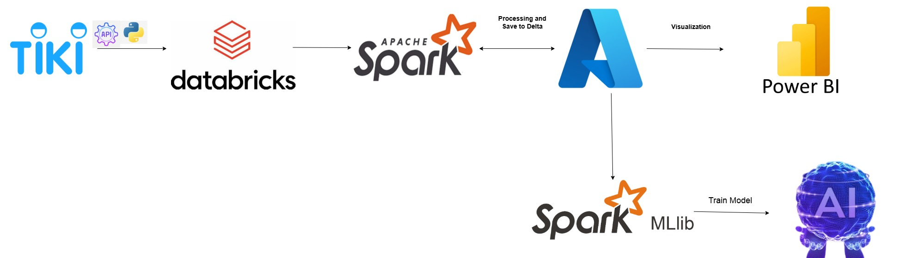

# Streamming-Tiki-E-Commerce
This project involves building an end-to-end data pipeline that integrates real-time data crawling from the Tiki API, storing and processing it on Azure Cloud, and leveraging analytics and machine learning to extract actionable insights. The system is designed to automate data ingestion, processing, and visualization, ensuring seamless scalability and adaptability for real-time and batch processing.
Project Workflow:

Data Crawling: Use Python scripts to extract product and transactional data from the Tiki API in real time.
Ensure data quality through pre-processing (e.g., filtering, cleaning, and deduplication).  

Data Storage:Store the raw data in Azure Blob Storage.
Utilize Azure Databricks' DBFS (Databricks File System) to mount and access Azure Storage seamlessly. 

Data Processing:Implement data transformation pipelines using PySpark on Azure Databricks.
Perform aggregation, filtering, and enrichment to create structured datasets for downstream applications.
Store processed data back into Azure Blob Storage for future use.
Data Analysis and Visualization:

Connect processed data to Power BI for interactive dashboards and visualization.
Generate insights such as product trends, customer behavior, and sales performance.
Machine Learning:

Use the processed data for training machine learning models directly on Azure Databricks.
Implement feature engineering and hyperparameter tuning to optimize model performance.
Store trained models and predictions in the Azure Storage system for deployment and further analysis.
Key Technologies:

Tiki API: For real-time data crawling.
Azure Blob Storage: For scalable and secure data storage.
Azure Databricks: For data processing, transformation, and machine learning.
PySpark: For distributed data processing and analysis.
Power BI: For creating interactive dashboards and visualizations.

system architecture

